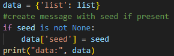
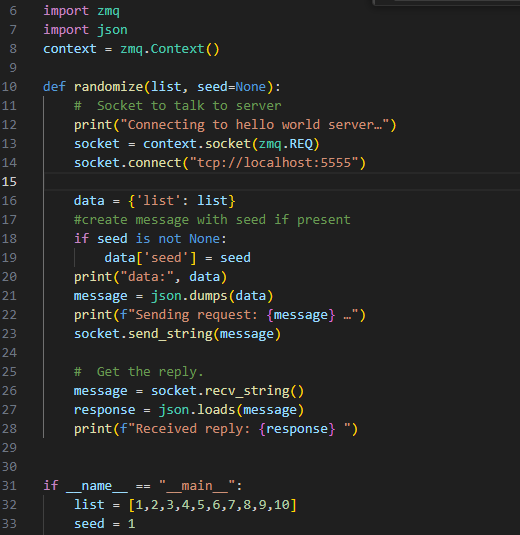
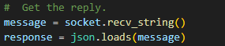
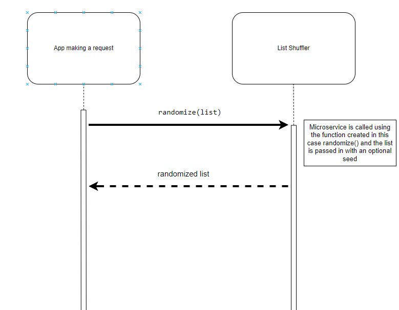

# CS 361 List Shuffler

## The List Shuffler 

### Communication Contract
This microservices can shuffle a list with the option of using a seed for verification purposes. It uses the Zero MQ pipe and it receives the information through the **socket.bind("tcp://*:5555")** zmq method. This biods it to all available networks associated with the machine running it. It uses the port number "5555". To change the port adjust the number accordingly.

### Requesting and Receiving Data
In order to request data from the micrcoservice, use the Zero MQ library associated with your language and use the function 

**socket.connect("tcp://localhost:5555")**

You are going to have to send the data using the socket.send_string(message) method. 

Make sure that the message you are sending is a JSON object with the list associated with the word "list" and the optional seed with the word "seed"

An example in python using the json library provided:

An example function to send a list to the microservice is provided in Python. Using the randomize function you pass a list and an optional seed. 

**Example: randomize(list, seed) or randomize(list)**

In order to receive data from the microservice use the associated libraries socket receiving string command. In the instance of receiving data through pythons zmq library it would be: **socket.recv_string()** command.

The response will be a JSON object which you then use the json.loads() method on to retrieve the randomized list.

### UML sequence diagram
